# WorkWise

## 📋 Project Description

WorkWise is a full-stack expense management and productivity platform designed to help users track expenses, gain insights, and manage financial data efficiently. The application provides a clean dashboard, expense categorization, and visual analytics using charts. It follows a modern **client–server architecture** with secure authentication, public and protected routing, and includes an integrated **Gemini-powered chatbot** to assist users with navigation, feature understanding, and overall usage support.

---

## 📑 Table of Contents

- [Features](#features)
- [Tech Stack](#tech-stack)
- [Project Structure](#project-structure)
- [Screenshots](#screenshots)
- [Installation & Setup](#installation--setup)
- [Running the Project](#running-the-project)
- [How to Use the Application](#how-to-use-the-application)
- [Routing Strategy](#routing-strategy)
- [Future Improvements](#future-improvements)

---

## ✨ Features

- ✅ User authentication (Signup / Login)
- ✅ Protected expense hub for authenticated users
- ✅ Add, view, and manage expenses
- ✅ Expense insights with bar and pie charts
- ✅ Monthly and daily category-based analysis
- ✅ User-specific workflows (Student, Freelancer, Traveller)
- ✅ Integrated Gemini chatbot for in-app assistance
- ✅ Clean UI with reusable components
- ✅ Secure API with token-based authentication

---

## 🛠️ Tech Stack

### Frontend
- React
- React Router
- Chart.js
- Tailwind CSS
- Axios

### Backend
- Node.js
- Express.js
- MongoDB
- JWT Authentication

---

## 📁 Project Structure

```
workwise/
│
├── client/
│   └── workwise/
│       ├── src/
│       │   ├── assets/
│       │   ├── pages/
│       │   ├── context/
│       │   ├── routes/
│       │   ├── api/
│       │   ├── screenshots/
│       │   └── App.jsx
│       └── package.json
│
├── server/
│   ├── controllers/
│   ├── models/
│   ├── routes/
│   ├── middleware/
│   ├── config/
│   ├── .env.example
│   └── index.js
│
└── README.md
```

---

## 📸 Screenshots

### Landing Page
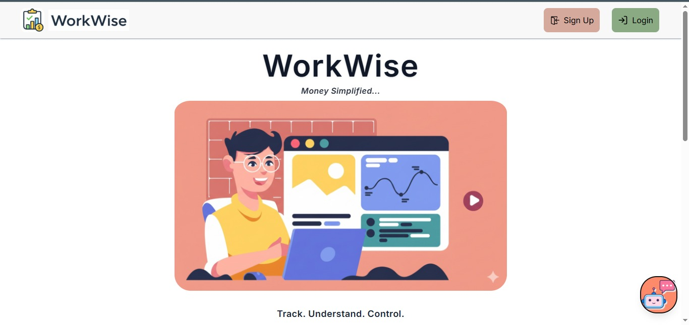
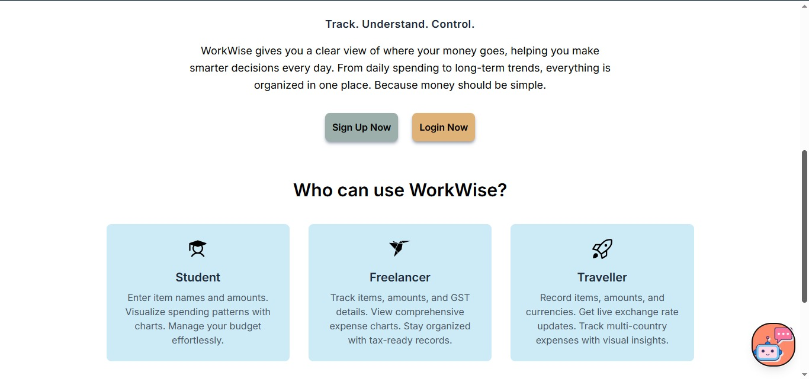
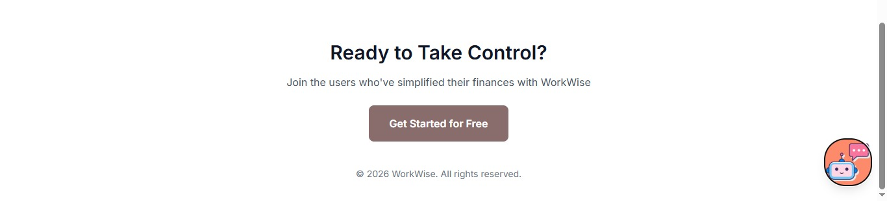

### Authentication

#### Signup Page
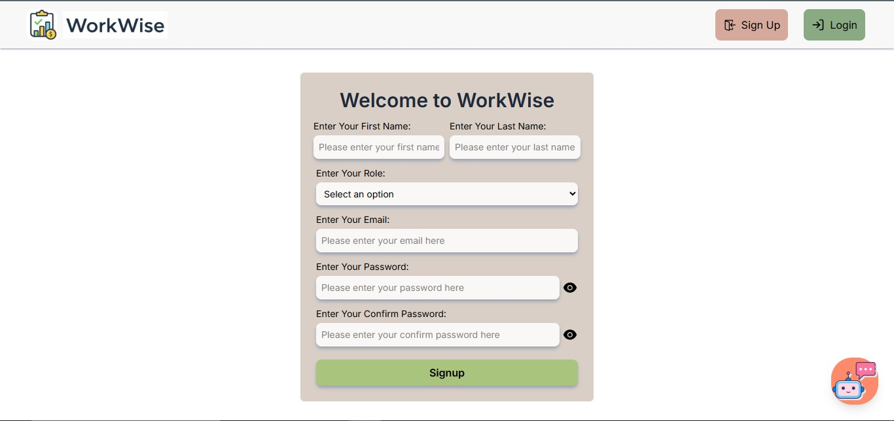

#### Login Page
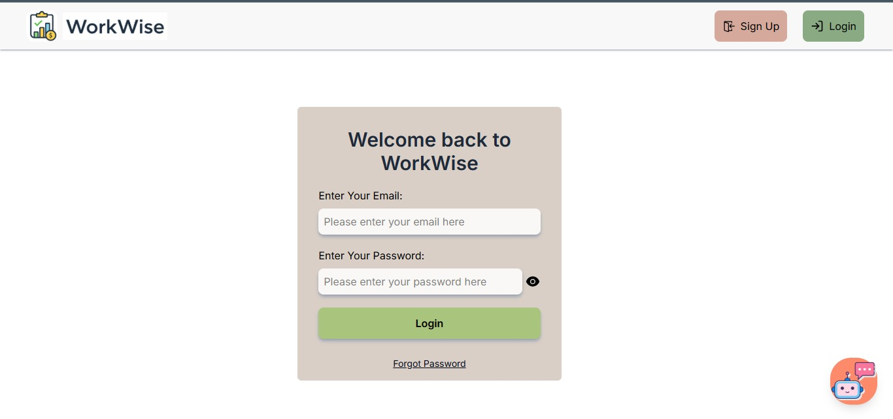

#### Expense Hub


#### Chat Bot
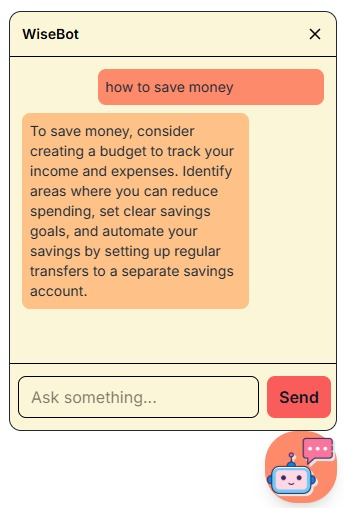

### Student Workflow

#### Add Expense
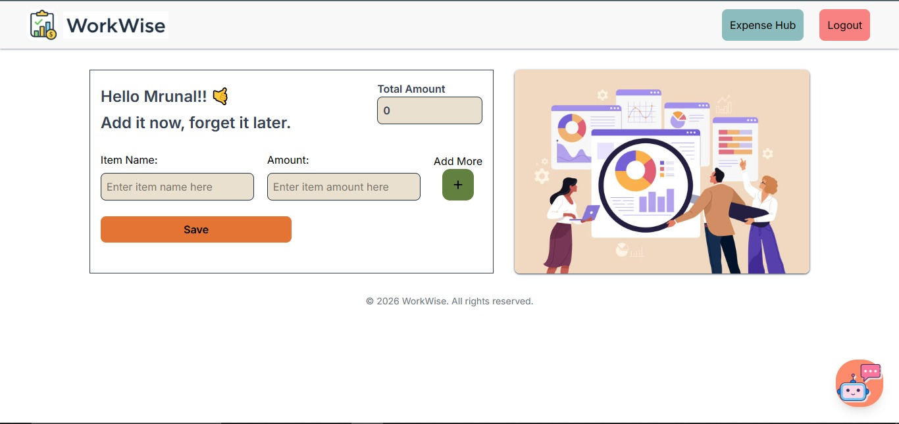

#### Expense Insights
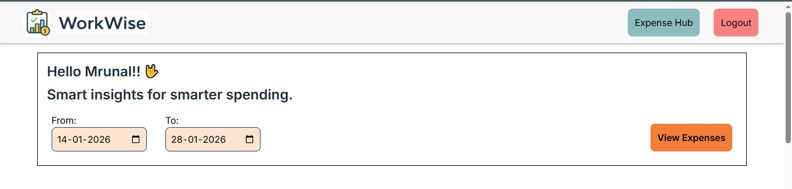
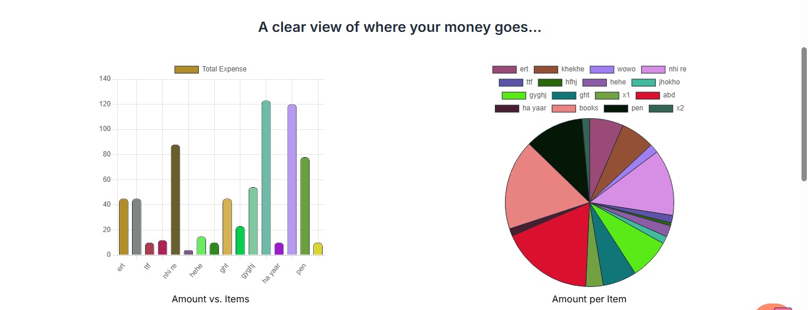
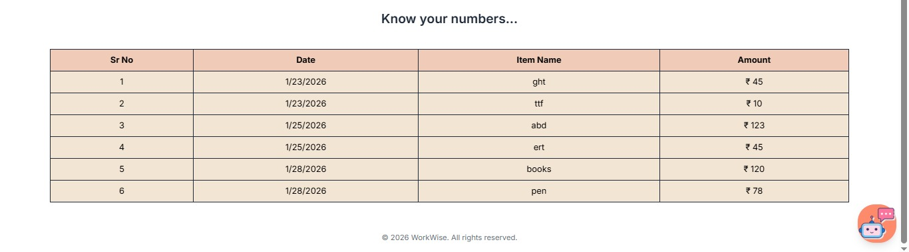

### Freelancer Workflow

#### Add Expense
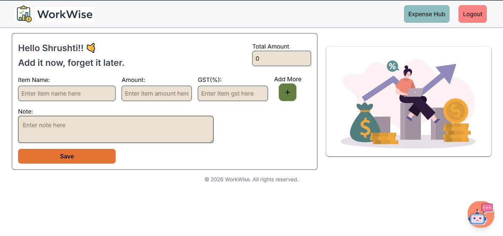

#### Expense Insights
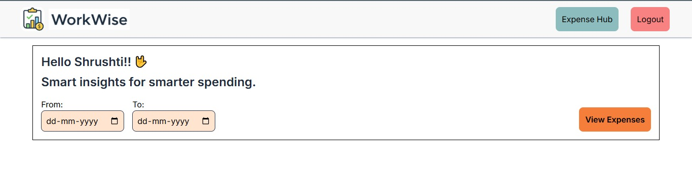
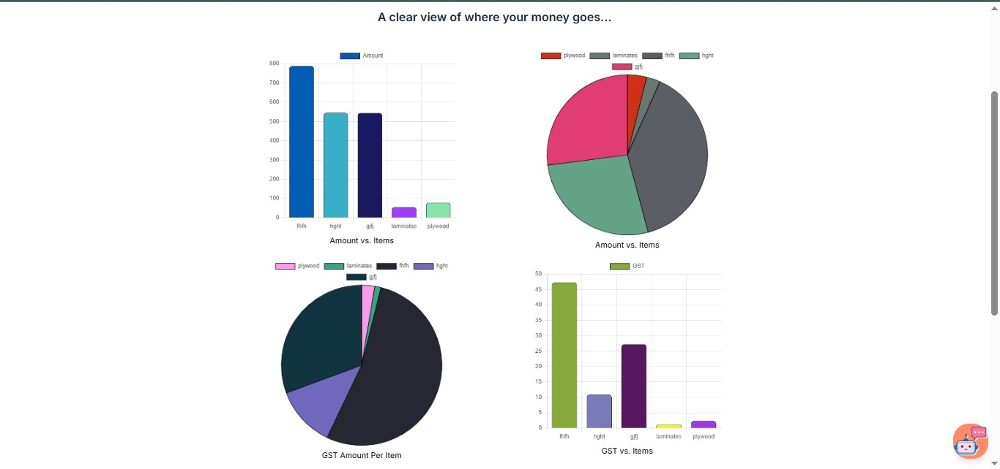
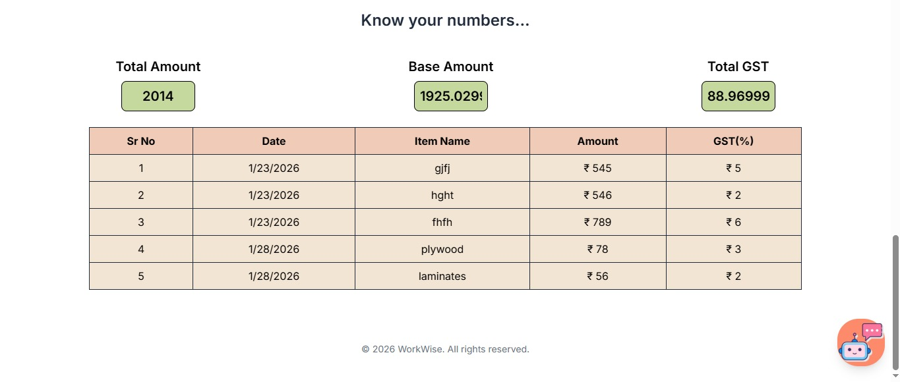

### Traveller Workflow

#### Add Expense
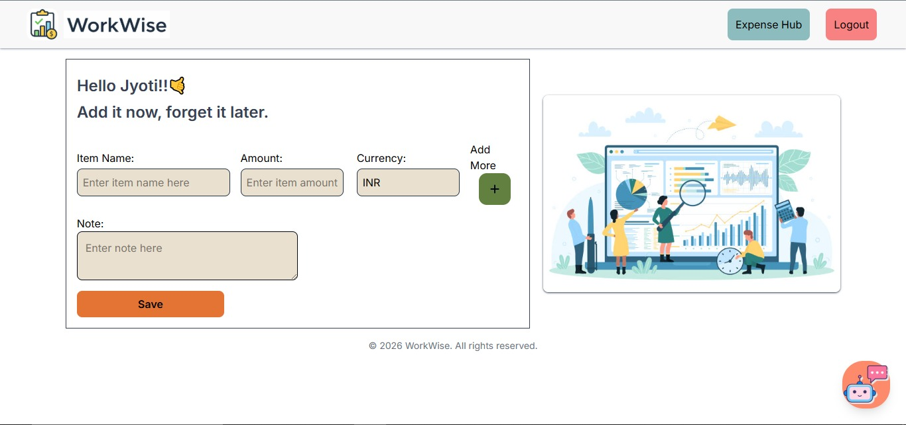

#### Expense Insights
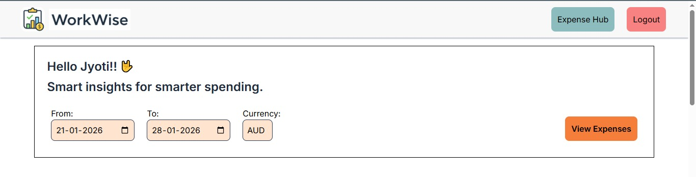
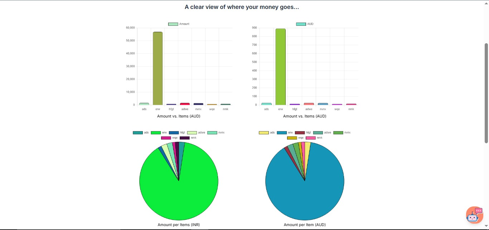
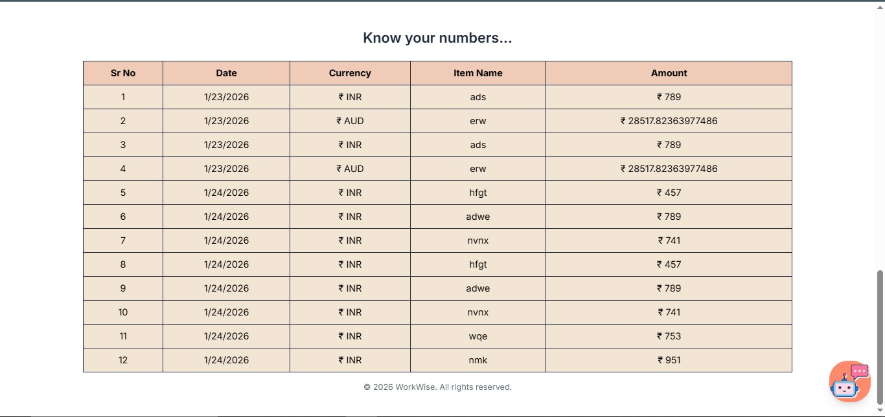

---

## 🚀 Installation & Setup

### Prerequisites

Before you begin, ensure you have the following installed:
- [Node.js](https://nodejs.org/) (v14 or higher)
- [MongoDB](https://www.mongodb.com/) installed locally or a [MongoDB Atlas](https://www.mongodb.com/cloud/atlas) account
- [Git](https://git-scm.com/)

### 1️⃣ Backend Setup

Navigate to the `server` folder and install dependencies:

```bash
cd server
npm install
```

Create a `.env` file based on `.env.example`:

```env
PORT=4000
MONGO_URI=your_mongodb_connection_string
JWT_SECRET=your_secret_key
MAIL_HOST=your_mail_host
MAIL_USER=your_mail_user
MAIL_PORT=your_mail_port
MAIL_PASSWORD=your_mail_password
```

Start the backend server:

```bash
npm run start
# or
node server.js
```

The backend will run on: **http://localhost:4000**

### 2️⃣ Frontend Setup

Navigate to the `client/workwise` folder and install dependencies:

```bash
cd client/workwise
npm install
```

Start the frontend development server:

```bash
npm run dev
```

The frontend will run on: **http://localhost:5173**

---

## ▶️ Running the Project

Once both servers are running:

- **Frontend**: http://localhost:5173
- **Backend**: http://localhost:4000

Open your browser and navigate to the frontend URL to start using WorkWise!

---

## 📖 How to Use the Application

1. **Open the application** in your browser at http://localhost:5173
2. **Sign up** using a new account or **login** with existing credentials
3. After login, you will be redirected to the **Expense Hub** page
4. **Add new expenses** using the Add Expense page
5. **Analyze expenses** using charts and monthly filters
6. Use the **Gemini chatbot** for assistance with features and navigation

---

## 🗺️ Routing Strategy

### Public Routes
- `/` – Landing page
- `/login` – User login
- `/signup` – User registration

### Protected Routes
- `/expense-hub` – Expense analytics dashboard
- `/add-expense` – Add new expense form

> **Note**: Unauthorized users cannot access protected routes and will be redirected to the login page.

---

## 🔮 Future Improvements

- [ ] Edit and delete expenses functionality
- [ ] Export expense reports (PDF/CSV)
- [ ] Dark mode toggle
- [ ] Role-based access control (Admin, User)
- [ ] Mobile responsive optimization
- [ ] Budget limit alerts and notifications
- [ ] Multi-currency support
- [ ] Recurring expense tracking

---

## 👨‍💻 Author

**Mrunal Deore**

---

## 📄 License

This project is for educational and personal use.

---

## 🤝 Contributing

Contributions, issues, and feature requests are welcome! Feel free to check the issues page.

---

## 📧 Support

If you have any questions or need help with setup, please open an issue in the repository.

---

<div align="center">
  <p>Made with ❤️ by Mrunal Deore</p>
  <p>⭐ Star this repo if you found it helpful!</p>
</div>
